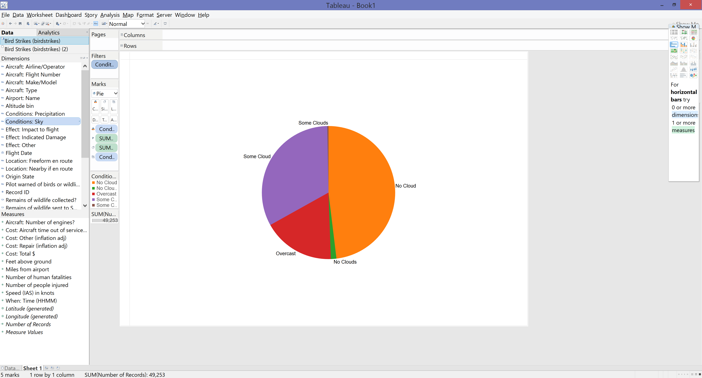
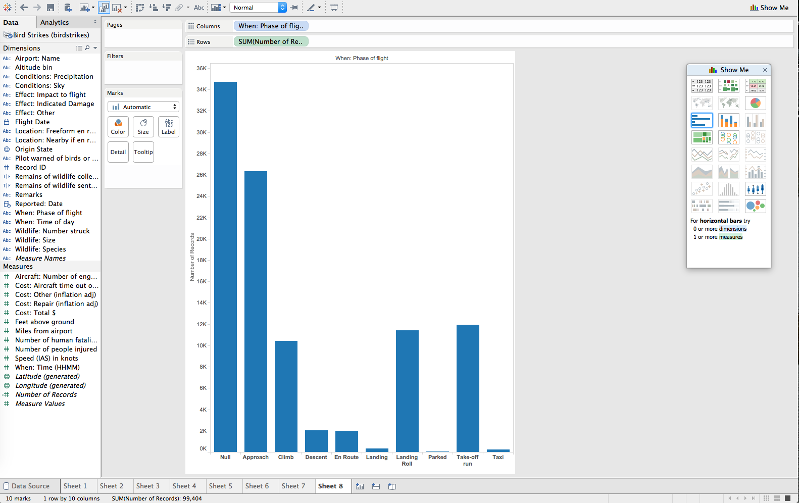
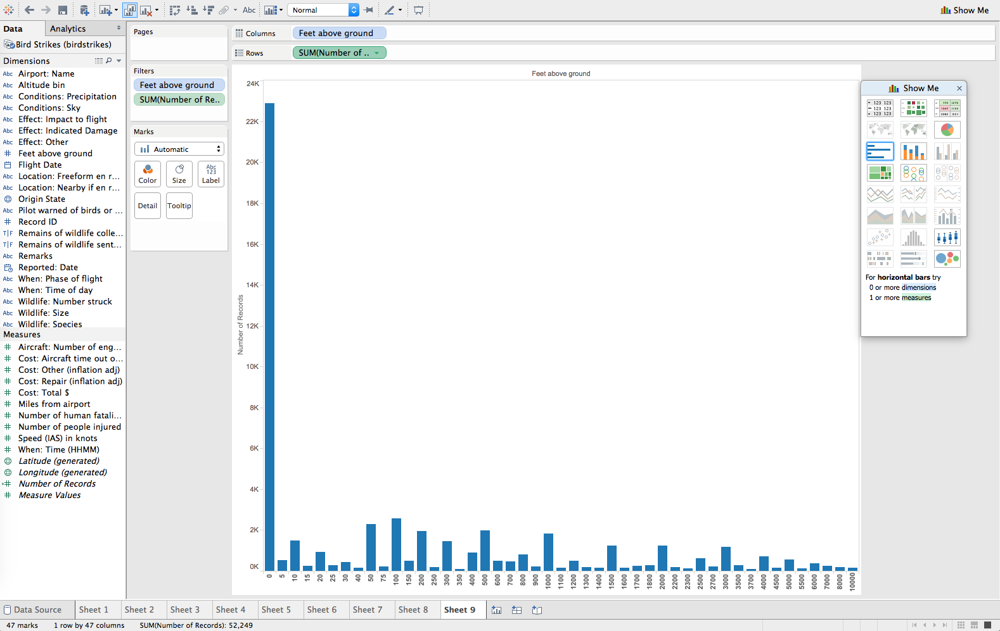
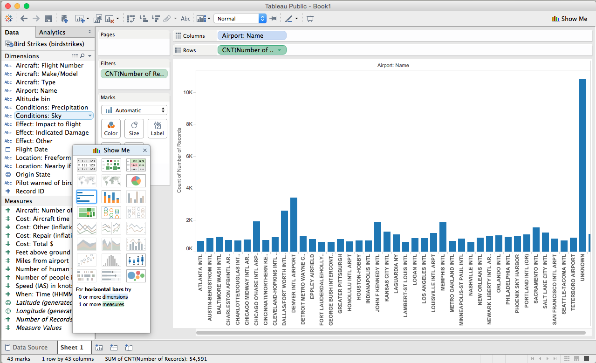
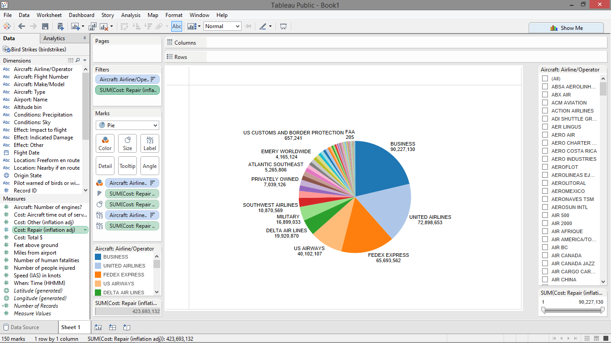

# Report

Using Tableau, create visualization for each question in the report regarding
bird strikes.

# Authors

This report is prepared by
* [William Farmer](http://github.com/willzfarmer)
* [Parker Illig](http://github.com/pail4944)
* [Kevin Gifford](http://github.com/kevinkgifford)
* [John Raesly](http://github.com/jraesly)
* [Andrew Krodinger](http://github.com/drewdinger)

# what are the condition:sky where usually caused a damage? - by fadhilfath

# Kevin Gifford: Flight Phase of Birdstrikes:

# What is the correlation between the feet above the ground and the number of bird strikes

# Which airport had the highest number of bird strikes? (Zhya215).

# Which airline have to incur most repair cost due to damage ? (sumi6109)

# Which plane model strikes the most birds?

